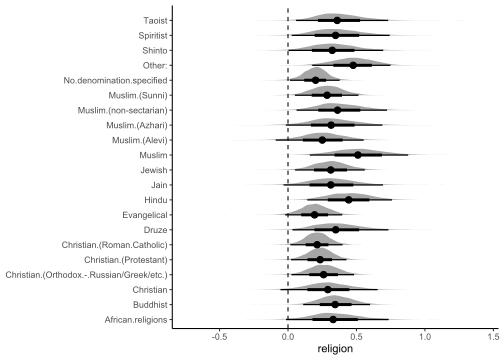
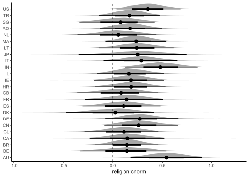

Religion, Cultural Norms, and Wellbeing: A Bayesian Multilevel Analysis
================
Scott Claessens, Kyle Fischer, Guy Lavender Forsyth, Thanos Kyritsis,
and Quentin Atkinson
2021-02-24

# Analytic Strategy

Do religious people report higher wellbeing? And is this relation
moderated by perceived cultural norms of religion? In order to answer
these questions, we constructed a series of Bayesian multilevel
cumulative link models, which are appropriate for highly nested ordinal
data, and fitted these models to the data in stacked format, with
separate rows for each individual wellbeing item (n = 183510). The key
dependent variable for all our models was perceived wellbeing, with
wellbeing subscales and items included as random effects. The main
predictor, religiosity, was defined as the first principal component in
a principal component analysis including all nine religiosity items,
which explained about 80% of the variance (see scree plot in Figure 1).

<!-- -->

<span style="font-size:0.9em">***Figure 1.*** *Scree plot for principal
components analysis of nine religion items in the dataset. Following
both the point of inflexion and Kaiser’s criterion<sup>1</sup>
(i.e. retaining principal components with eigenvalues above one), we
should retain one principal component.*</span><br><br>

The second predictor, perceived cultural norms of religion, was the
average of two items measuring the extent to which participants perceive
religion being important in their country. Our models also included a
number of control variables (age, gender, and scaled GDP), and random
intercepts and slopes grouped by wellbeing subscale and item,
participant ID, participant country, and participant religious
denomination. Finally, in another set of models, we additionally let
country-level random intercepts covary according to their linguistic
proximity (see below for more details).

We introduced these variables into our models incrementally. Initially,
we ran an intercept-only model (the outcome variable predicted by
demographic controls and random intercepts, without religiosity and
cultural norms) to determine a baseline effect. Next, we added
religiosity as a main predictor (research question 1), and then cultural
norms and its interaction with religiosity (research question 2).
Lastly, we repeated these analyses by adding a linguistic proximity
matrix between the 24 countries in the sample. The full model was as
follows:

``` r
wellbeing ~ 1 + religion*cnorm + (1 + religion*cnorm | subscale/item) + 
  (1 + religion*cnorm | iso) + (1 + religion*cnorm | denomination) + 
  (1 | subject) + age + gender + gdp_scaled
```

where `wellbeing`, `religion`, and `cnorm` correspond to the three main
variables as described above, `subscale` and `item` refer to the
wellbeing subscale and item, `iso` is the ISO-3166-1 code assigned to
the participant’s country, `denomination` is the participant’s reported
religious denomination, `subject` is the participant’s ID, and `age`,
`gender`, and `gdp_scaled` are the demographic variables.

The final step of accounting for linguistic proximity was necessary in
order to control for Galton’s problem<sup>2</sup>, i.e. observed
similarities between closely-related cultures being due to their common
history. To produce this matrix, we joined all language family trees
published in Glottolog v3.0<sup>3</sup> into an undated and unresolved
global language tree. We then calculated proximity

between two languages
 and
 as
the distance (in number of nodes traversed) of their most recent common
ancestor
 to
the root of the tree, through the formula:

<p align="center">


</p>

where

is the maximum path length (in number of nodes traversed) leading to the
pan-human root
, and

is the maximum path length leading to node
.

We then paired this data with speaker percentages from Ethnologue
21<sup>4</sup>, and set linguistic proximity between two countries as
the cultural proximities between all languages spoken within them,
weighted by respective speaker percentages (1 per mille was used as a
realistic cut-off point), through the formula:

<p align="center">


</p>

where

is the percentage of the population in nation

speaking language
,

is the percentage of the population in nation

speaking language
, and

is the proximity measure between languages
 and
<sup>5,6</sup>.

Bayesian model priors were based on prior predictive simulation. All
models had zero divergent transitions and converged normally
(
\< 1.05). The analysis pipeline was run in R v4.0.2.<sup>7</sup> using
the *drake* package<sup>8</sup> for reproducible high performance
computing, the *brms* package<sup>9</sup> for model fitting, and the
*loo* package<sup>10</sup> for model comparison with approximate
leave-one-out cross-validation using subsampling<sup>11</sup>.

# Results

## Research Question 1

Does religiosity predict wellbeing? Yes. The model including the
religiosity predictor fits the data better than the null model
(difference in ELPD = 1221.3, SE = 59.8) and the fixed effect shows that
religiosity is associated with greater overall wellbeing (b = 0.32, SE =
0.11, 95% credible interval \[0.12 0.53\]; Figure 2).

<!-- -->

<span style="font-size:0.9em">***Figure 2.*** *The effect of religiosity
on overall wellbeing. Regression lines and 95% credible interval shaded
areas are predictions from our Bayesian multilevel cumulative link
model, controlling for age, gender, and GDP but not controlling for
linguistic proximity between countries.*</span><br><br>

This positive effect of religiosity holds for social, psychological, and
physical wellbeing subscales, and most individual wellbeing items (the
effect is particularly pronounced for meaningfulness), though the 95%
credible intervals include zero for mobility, negative affect, physical
pain, and medical dependence (Figure 3). The positive effect of
religiosity on wellbeing also holds for most countries in the sample,
but the 95% credible intervals overlap with zero for Singapore, the
Netherlands, the UK, Spain, Denmark, Chile, and Canada (Figure 4). The
positive effect of religiosity also holds across most religious
denominations in the sample, but the 95% credible intervals include zero
for Shinto, Azhari and Alevi Muslim, Jain, Evangelical Christian,
Christian (denomination unspecified), and African religions (Figure 5).

<!-- -->

<span style="font-size:0.9em">***Figure 3.*** *Density plot showing how
the effect of religiosity on wellbeing varies across individual
wellbeing items. The visualised posterior distribution is from our
Bayesian multilevel cumulative link model, controlling for age, gender,
and GDP but not controlling for linguistic proximity between countries.
Densities are posterior distributions for random effects, points are
posterior medians, lines are 66% and 95% credible
intervals.*</span><br><br>

<!-- -->

<span style="font-size:0.9em">***Figure 4.*** *Density plot showing how
the effect of religiosity on wellbeing varies across individual
countries. The visualised posterior distribution is from our Bayesian
multilevel cumulative link model, controlling for age, gender, and GDP
but not controlling for linguistic proximity between countries.
Densities are posterior distributions for random effects, points are
posterior medians, lines are 66% and 95% credible
intervals.*</span><br><br>

<!-- -->

<span style="font-size:0.9em">***Figure 5.*** *Density plot showing how
the effect of religiosity on wellbeing varies across individual
religious denominations. The visualised posterior distribution is from
our Bayesian multilevel cumulative link model, controlling for age,
gender, and GDP but not controlling for linguistic proximity between
countries. Densities are posterior distributions for random effects,
points are posterior medians, lines are 66% and 95% credible
intervals.*</span><br><br>

Do these results change when controlling for cultural connections
between countries (i.e., linguistic proximity)? Essentially, no.
However, in this model, the 95% credible intervals no longer include
zero for some countries (the UK and Canada) and some religious
denominations (Shinto and African religions), revealing a positive
effect of religion for these clusters when controlling for linguistic
proximity.

## Research Question 2

Does the effect of religiosity on wellbeing depend on perceiving others
to be religious? Our results indicate that the effect of religiosity on
wellbeing is only weakly and inconsistently moderated by religious
norms. A model including an interaction between religiosity and
religious norms does fit the data better than one which excludes
religious norms (difference in ELPD = 256.7, SE = 34.1; cautious
interpretation is needed here due to substantial subsampling error, SSE
= 267.0). The interaction fixed effect from this model indicates that
the effect of religiosity on overall wellbeing is minimally increased
when participants perceive religion to be important in their country (b
= 0.20, SE = 0.14, 95% credible interval \[-0.07 0.47\]; Figure 6),
though the 95% credible interval for this effect includes zero.

<!-- -->

<span style="font-size:0.9em">***Figure 6.*** *The interaction between
religiosity and cultural norms. Regression lines and 95% credible
interval shaded areas are predictions from our Bayesian multilevel
cumulative link model, controlling for age, gender, and GDP but not
controlling for linguistic proximity between countries.*</span><br><br>

Why only this small and inconsistent interaction effect? Our modelling
indicates that it is likely due to variation in the interaction effect
across individual wellbeing items and individual countries. How does the
interaction effect fare across individual wellbeing items? Figure 7
supports the hypothesised positive interaction effect for most
individual wellbeing items, including general satisfaction with health,
energy for everyday life, satisfaction with sleep, ability to perform
daily living activities, ability to concentrate, acceptance of bodily
appearance, satisfaction with oneself, frequency of negative feelings,
satisfaction with personal relationships, and satisfaction with sex
life. However, we find that the interaction effect is negative for
wellbeing items capturing pain, medical dependence, and mobility, and
for others the 95% credible interval includes zero.

<!-- -->

<span style="font-size:0.9em">***Figure 7.*** *Density plot showing how
the interaction effect varies across individual wellbeing items. The
visualised posterior distribution is from our Bayesian multilevel
cumulative link model, controlling for age, gender, and GDP but not
controlling for linguistic proximity between countries. Densities are
posterior distributions for random effects, points are posterior
medians, lines are 66% and 95% credible intervals.*</span><br><br>

How does the interaction effect vary across individual countries and
religious denominations? Only the USA, India, and Australia show
positive interaction effects with 95% credible intervals above zero
(Figure 8). Across individual religious denominations, all 95% credible
intervals include zero without large differences between denominations
(Figure 9).

<!-- -->

<span style="font-size:0.9em">***Figure 8.*** *Density plot showing how
the interaction effect varies across individual countries. The
visualised posterior distribution is from our Bayesian multilevel
cumulative link model, controlling for age, gender, and GDP but not
controlling for linguistic proximity between countries. Densities are
posterior distributions for random effects, points are posterior
medians, lines are 66% and 95% credible intervals.*</span><br><br>

<!-- -->

<span style="font-size:0.9em">***Figure 9.*** *Density plot showing how
the interaction effect varies across individual religious denominations.
The visualised posterior distribution is from our Bayesian multilevel
cumulative link model, controlling for age, gender, and GDP but not
controlling for linguistic proximity between countries. Densities are
posterior distributions for random effects, points are posterior
medians, lines are 66% and 95% credible intervals.*</span><br><br>

Most of these results are unchanged when controlling for linguistic
proximity between countries, except that in this model the 95% credible
intervals for the interaction effect include zero for some wellbeing
items (mobility and personal relations).

# References

<div id="refs" class="references">

<div id="ref-Kaiser1960">

1\. Kaiser, H. F. The application of electronic computers to factor
analysis. *Educational and Psychological Measurement* **20**, 141–151
(1960).

</div>

<div id="ref-Naroll1961">

2\. Naroll, R. Two solutions to galton’s problem. *Philosophy of
Science* **28**, 15–39 (1961).

</div>

<div id="ref-Glottolog">

3\. Hammarström, H., Forkel, R., Haspelmath, M. & Bank, S. *Glottolog
3.0*. (Max Planck Institute for the Science of Human History, 2017).
doi:[10.5281/zenodo.4061162](https://doi.org/10.5281/zenodo.4061162).

</div>

<div id="ref-Ethnologue">

4\. *Ethnologue: Languages of the world*. (SIL International, 2018).

</div>

<div id="ref-Claessens2020">

5\. Claessens, S., Kyritsis, T. & Atkinson, Q. D. Revised analysis shows
relational mobility predicts sacrificial behavior in footbridge but not
switch or loop trolley problems. *Proceedings of the National Academy of
Sciences* **117**, 13203–13204 (2020).

</div>

<div id="ref-Eff2008">

6\. Eff, E. A. Weight matrices for cultural proximity: Deriving weights
from a language phylogeny. *Structure and Dynamics* **3**, (2008).

</div>

<div id="ref-RCoreTeam">

7\. R Core Team. *R: A language and environment for statistical
computing*. (R Foundation for Statistical Computing, 2017).

</div>

<div id="ref-Landau2018">

8\. Landau, W. M. The drake r package: A pipeline toolkit for
reproducibility and high-performance computing. *Journal of Open Source
Software* **3**, (2018).

</div>

<div id="ref-Burkner2017">

9\. Bürkner, P.-C. brms: An R package for Bayesian multilevel models
using Stan. *Journal of Statistical Software* **80**, 1–28 (2017).

</div>

<div id="ref-Vehtari2017">

10\. Vehtari, A., Gelman, A. & Gabry, J. Practical bayesian model
evaluation using leave-one-out cross-validation and waic. *Statistics
and Computing* **27**, 1413–1432 (2017).

</div>

<div id="ref-Magnusson2019">

11\. Magnusson, M., Andersen, M., Jonasson, J. & Vehtari, A. Bayesian
leave-one-out cross-validation for large data. in *International
conference on machine learning* 4244–4253 (PMLR, 2019).

</div>

</div>
